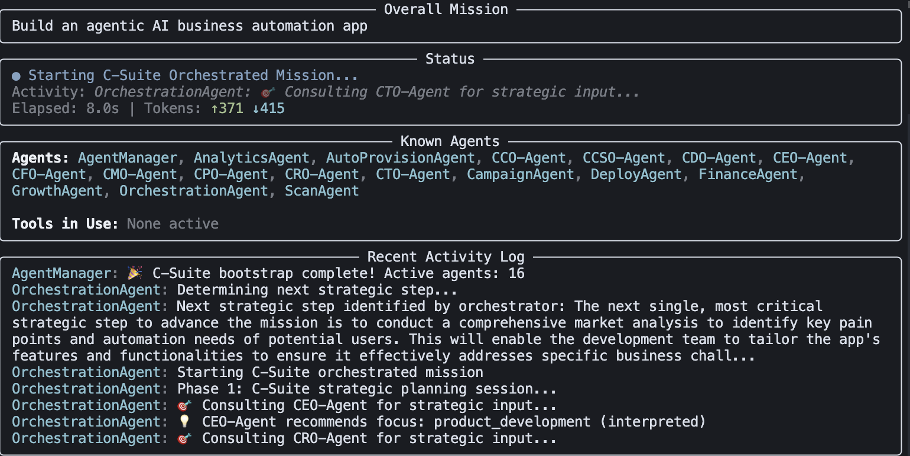
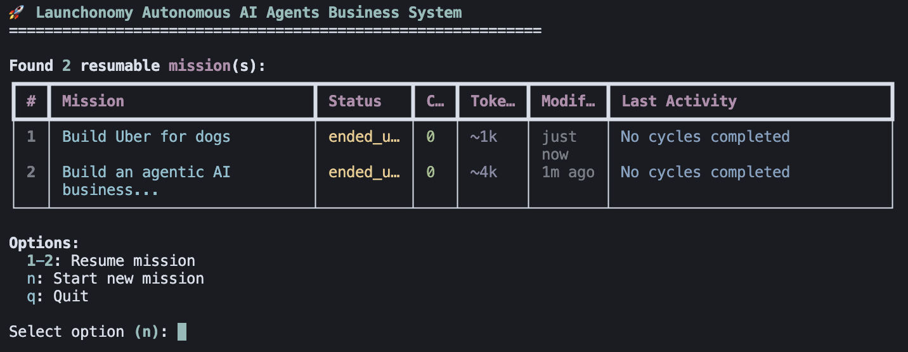

# 🚀 Launchonomy - Autonomous AI Business Orchestration System

A comprehensive system for orchestrating AI agents to build and grow autonomous businesses through C-Suite strategic decision-making and workflow automation.

<p>
  <video src="https://github.com/user-attachments/assets/a58449d2-9f7b-4c98-b588-1b805a3ec7ff" controls="controls" style="max-width: 600px;"></video>
</p>

## 🤖 Built With AI

This project is built using cutting-edge AI development tools and frameworks:

- **🔧 Framework**: [Microsoft AutoGen](https://github.com/microsoft/autogen) - Multi-agent conversation framework
- **💻 Development**: [Cursor](https://cursor.sh/) + [Claude Sonnet 4](https://www.anthropic.com/claude) - AI-powered coding
- **🧠 Advisory**: [ChatGPT o1-mini](https://openai.com/chatgpt) - Strategic guidance and architecture advice

*Launchonomy represents the future of AI-assisted development - where AI agents not only run businesses but also build the systems that run them.*

## 🚀 Quick Start

### Prerequisites

1. Python 3.8+
2. OpenAI API key
3. ChromaDB (automatically installed with requirements)

### Installation

#### Option 1: Install directly from GitHub (Recommended)
```bash
pip install git+https://github.com/mitchellfyi/launchonomy.git
```

#### Option 2: Install from source
1. Clone the repository:
```bash
git clone https://github.com/mitchellfyi/launchonomy.git
cd launchonomy
```

2. Install in development mode:
```bash
pip install -e .
```

#### Option 3: Install with development dependencies
```bash
pip install "git+https://github.com/mitchellfyi/launchonomy.git[dev]"
```

### Setup

Set up your OpenAI API key:
```bash
export OPENAI_API_KEY="your-api-key-here"
# Or create a .env file with: OPENAI_API_KEY=your-api-key-here
```

### Verify Installation

Test that everything is working correctly:
```bash
python tests/test_install.py
```

Or test the CLI directly:
```bash
launchonomy --help
```

### Running Launchonomy

#### Option 1: Using the installed command (after pip install)
```bash
launchonomy
```

#### Option 2: With specific mission
```bash
launchonomy "Build a profitable SaaS application"
```

#### Option 3: Force new mission (skip resume menu)
```bash
launchonomy --new "Create an AI-powered newsletter service"
```

#### Option 4: From source (if not installed)
```bash
python main.py
```

#### Option 5: Direct module execution
```bash
python -m launchonomy.cli
```

## 🎯 How It Works

<p>
  
</p>

### C-Suite Orchestrated Approach

Launchonomy implements a unique **C-Suite orchestrated** approach where:

1. **Strategic Planning**: C-Suite agents (CEO, CRO, CTO, CFO) make high-level strategic decisions
2. **Workflow Execution**: Specialized workflow agents execute operational tasks
3. **Strategic Review**: C-Suite agents review results and adjust strategy
4. **Continuous Iteration**: The cycle repeats until mission objectives are achieved

### Workflow Agent Sequence

The system executes workflow agents in a logical business sequence:

1. **ScanAgent** - Identifies market opportunities
2. **DeployAgent** - Builds and deploys products/services  
3. **CampaignAgent** - Creates and manages marketing campaigns
4. **AnalyticsAgent** - Tracks performance and generates insights
5. **FinanceAgent** - Manages financial operations and compliance
6. **GrowthAgent** - Optimizes for growth and scaling

### Mission-Scoped RAG Memory System

Launchonomy features an advanced **mission-scoped RAG (Retrieval-Augmented Generation) memory system** powered by ChromaDB that enables agents to learn from past experiences and make context-aware decisions:

#### 🧠 **Memory Architecture**
- **Per-Mission Vector Store**: Each mission gets its own ChromaDB collection stored in `~/.chromadb_launchonomy/mission_<mission_id>`
- **Persistent Memory**: Memories persist across mission cycles and system restarts
- **Semantic Search**: Agents can query memories using natural language to find relevant past experiences
- **Structured Metadata**: Memories are tagged with mission ID, agent name, workflow step, timestamp, and category

#### 🔍 **Memory Types**
- **Workflow Events**: Key outcomes from each workflow step (scan results, deployment details, campaign performance)
- **Strategic Insights**: Learnings and observations from agents during execution
- **Decision Records**: Important decisions made by agents with their reasoning
- **Performance Metrics**: Quantitative results and KPIs from each cycle
- **Success Patterns**: Successful strategies and approaches for future replication
- **Error Learning**: Failed attempts and their causes for future avoidance

#### 🤖 **RetrievalAgent**
A specialized agent that provides memory access to all other agents:
- **Semantic Retrieval**: Query memories using natural language descriptions
- **Filtered Search**: Search by specific workflow steps, time periods, or categories
- **Context Integration**: Automatically enriches agent prompts with relevant memories
- **Memory Statistics**: Provides insights into memory store usage and growth

#### 💡 **Context-Aware Decision Making**
Every agent automatically receives relevant memories before making decisions:
```
Relevant Mission Memory:
- [scan - 2024-01-15] Previous scan found AI newsletter services have 85% higher conversion rates
- [deploy - 2024-01-14] MVP deployment using Next.js reduced time-to-market by 40%
- [campaign - 2024-01-13] Email campaigns outperformed social media by 3x in customer acquisition
```

### Mission Logging

Every mission is comprehensively logged with:
- Strategic decisions from C-Suite agents
- Workflow agent execution results
- Financial tracking and guardrails
- Error handling and recovery
- Token usage and costs
- Memory interactions and learnings

Mission logs are saved as JSON files with parameterized names:
```
mission_logs/mission_20250526_005050_test_reorganized_codebase.json
```

## 🏗️ Architecture

Launchonomy uses a modular architecture with clear separation of concerns:

```
launchonomy/
├── launchonomy/                    # Main package
│   ├── cli.py                      # Command line interface
│   ├── core/                       # Core orchestration logic
│   │   ├── orchestrator.py         # Main orchestrator agent
│   │   ├── mission_manager.py      # Mission lifecycle management
│   │   ├── agent_manager.py        # Agent lifecycle management
│   │   ├── communication.py       # Agent communication
│   │   └── vector_memory.py        # ChromaDB vector memory system
│   ├── agents/                     # All agent implementations
│   │   ├── base/                   # Base classes
│   │   │   └── workflow_agent.py   # Base workflow agent
│   │   ├── workflow/               # Workflow agents
│   │   │   ├── scan.py             # Market scanning
│   │   │   ├── deploy.py           # Product deployment
│   │   │   ├── campaign.py         # Marketing campaigns
│   │   │   ├── analytics.py        # Analytics and metrics
│   │   │   ├── finance.py          # Financial management
│   │   │   └── growth.py           # Growth optimization
│   │   ├── retrieval_agent.py      # RAG memory retrieval agent
│   │   └── csuite/                 # C-Suite agents (future)
│   ├── registry/                   # Agent registry system
│   │   ├── registry.py             # Agent discovery and management
│   │   └── registry.json           # Agent specifications
│   ├── templates/                  # Agent templates and prompts
│   ├── tools/                      # Tool implementations
│   │   └── stubs/                  # Tool stub files
│   └── utils/                      # Utilities
│       ├── cost_calculator.py      # Real-world cost tracking
│       ├── memory_helper.py        # Memory logging utilities
│       ├── logging.py              # Mission logging
│       ├── consensus.py            # Consensus voting
│       └── mission_log_navigator.py # Mission log analysis
├── tests/                          # Test suite
├── mission_logs/                   # Mission execution logs
├── docs/                           # Documentation files
│   ├── AUTOGEN_ARCHITECTURE.md     # AutoGen integration guide
│   ├── AUTOGEN_QUICK_REFERENCE.md  # AutoGen quick reference
│   ├── DEVELOPMENT_GUIDE.md        # Development guide
│   ├── MISSION_LIFECYCLE.md        # Mission lifecycle guide
│   └── TROUBLESHOOTING.md          # Troubleshooting guide
└── main.py                         # Entry point
```

## 📊 Mission Management

### Resume Previous Missions

Launchonomy automatically detects resumable missions and presents a menu:

<p>
  
</p>

### Mission Log Analysis

Use the mission log navigator to analyze completed missions:

```bash
python launchonomy/utils/mission_log_navigator.py
```

## 🛠️ Configuration

### Environment Variables

- `OPENAI_API_KEY` - Your OpenAI API key (required)
- `OPENAI_MODEL` - Model to use (default: gpt-4o-mini)

### Memory System Configuration

The ChromaDB vector memory system automatically creates mission-specific collections:
- **Storage Location**: `~/.chromadb_launchonomy/`
- **Collection Naming**: `mission_<mission_id>`
- **Persistence**: Memories persist across system restarts
- **Cleanup**: Old mission memories can be manually removed from the storage directory

### Command Line Options

- `--debug` - Enable detailed debug logging
- `--new` - Skip resume menu and force new mission
- `--max-iterations N` - Maximum iterations for continuous mode (default: 10)

## 🧪 Development

### Project Structure

The codebase follows a clean, modular architecture:

- **Core**: Main orchestration logic and management systems
- **Agents**: All agent implementations with clear inheritance hierarchy
- **Registry**: Dynamic agent discovery and lifecycle management
- **Utils**: Shared utilities for logging, consensus, cost tracking, etc.
- **Templates**: Agent prompts and configuration templates

### Adding New Agents

1. Create agent class inheriting from `BaseWorkflowAgent`
2. Implement required methods (`execute`, `get_capabilities`, etc.)
3. Add to appropriate module (`workflow/`, `csuite/`, etc.)
4. Register in the agent registry

### Testing

Run the test suite:
```bash
python -m pytest tests/
```

## 📈 Features

### ✅ Implemented
- C-Suite strategic orchestration
- Complete workflow agent sequence
- **Mission-scoped RAG memory system with ChromaDB**
- **Context-aware agent decision making**
- **Persistent cross-mission learning**
- Mission logging and resumability
- Financial guardrails and compliance
- Real-world cost tracking and calculation
- Token usage tracking
- Error handling and recovery
- Parameterized mission naming
- JSON parsing fallbacks for natural language responses

### 🚧 In Development
- Dedicated C-Suite agent implementations
- Advanced tool integration
- Real-time monitoring dashboard
- Multi-mission coordination

### 🔮 Planned
- Web interface
- API endpoints
- Plugin system
- Advanced analytics

## 📚 Documentation

### Core Documentation

- **[📖 AutoGen Architecture Guide](docs/AUTOGEN_ARCHITECTURE.md)** - Comprehensive guide explaining our strategic hybrid approach with Microsoft AutoGen v0.4
- **[⚡ AutoGen Quick Reference](docs/AUTOGEN_QUICK_REFERENCE.md)** - Developer quick reference for working with our AutoGen integration
- **[🎯 Mission Lifecycle Guide](docs/MISSION_LIFECYCLE.md)** - Complete guide to how missions work from start to finish
- **[🛠️ Development Guide](docs/DEVELOPMENT_GUIDE.md)** - Comprehensive guide for developers contributing to Launchonomy
- **[🚨 Troubleshooting Guide](docs/TROUBLESHOOTING.md)** - Solutions to common issues and debugging procedures

### AutoGen Integration Architecture

Launchonomy uses a strategic hybrid approach with Microsoft AutoGen v0.4:

**Key Architectural Decisions:**
- ✅ **Use AutoGen for Infrastructure** - Model clients, message handling, base agents
- ✅ **Build Custom for Business Logic** - C-Suite orchestration, mission management, workflows  
- ✅ **Maintain Clear Separation** - Technical foundation vs. business intelligence
- ✅ **Future-Proof Design** - Can adopt new AutoGen features selectively

This hybrid approach gives us the technical robustness of AutoGen with the business intelligence of custom domain-specific logic.

## 🤝 Contributing

1. Fork the repository
2. Create a feature branch
3. Make your changes following the existing architecture
4. Add tests for new functionality
5. Submit a pull request

## 📄 License

[License information]

## 🆘 Support

For issues, questions, or contributions, please [create an issue](link-to-issues) or reach out to the development team.

---

**Launchonomy** - Where AI agents build businesses autonomously 🚀 
